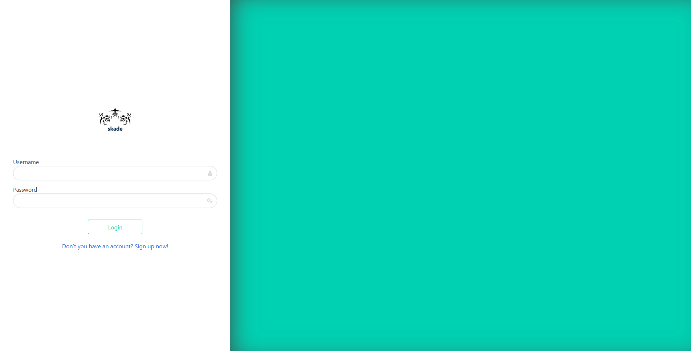

# Skade

Upload files and have them being scanned against local set of yara rules to possibly detect malware.

## Setup

The easiest way to setup the project is to use `docker-compose`

```
docker-compose up --build
```

## Technologies used:

* Python3
* Flask
* Dropzone.js
* Docker
* YARA rules

## Screenshots



