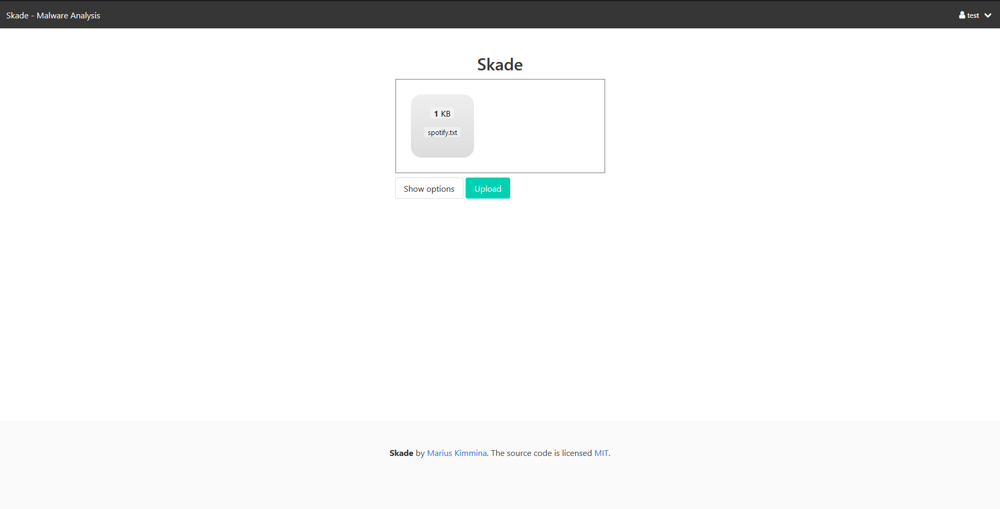

# Skade

Upload files and have them being scanned against local set of yara rules to possibly detect malware.

## Setup

The easiest way to setup the project is to use `docker-compose`.
First you need to rename the `env/postgres.env.dummy` to `postgres.env` 
and replace all the placeholder values with ones that you want to use.

```
docker-compose up --build
```

## Technologies used:

* Python3
* Flask
* Dropzone.js
* Docker
* YARA rules

## Scan results

There is currently no visible representation of the scan result in the web interface.
You can see if your file matched a yara rule in the Logs

```
skade       | [2021-11-27 14:50:54,626] DEBUG in scanner: start applying Yara rules
skade       | [2021-11-27 14:50:54,626] DEBUG in scanner: Compiling yara rules from source: /usr/share/yararules/
skade       | [2021-11-27 14:50:54,628] DEBUG in scanner: No Match found
```

## Screenshots



